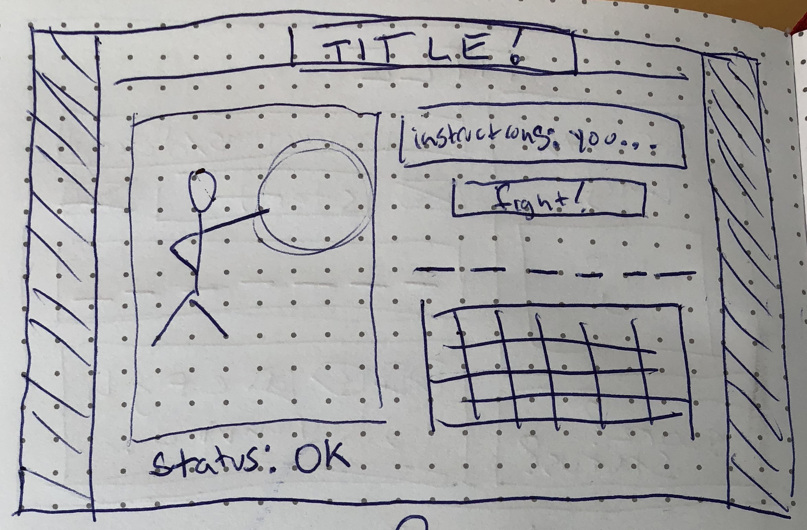

# Hangman Project

[Play it here](https://dreamy-lewin-34c0c7.netlify.com)

### Overview

For project #1, I created a game of hangman. However, I did move away from literal hangman imagery and included lighter subjects instead!

Once the user comes to the site, they can start playing hangman by selecting letters to fill in the mystery word. On a correct choice, the letter in the mystery word is revealed, but on an incorrect choice, the "hangman" image updates. The game ends when the player wins or loses. If the player completes the mystery word, they win, and the win counter increases. If the player makes 6 incorrect choices, the player loses. The player can get a hint about the mystery word, reset the game, and change to a different theme.

_Live site:_ ?

### Technologies Used
- Languages - HTML5, CSS3, Javascript, jQuery
- Design - Google Fonts
- Project Planning & User Stories - [Trello] (https://trello.com/b/1K2EesED/emmy-project-1-hangman)
- Visual Studio Code

### Features
- 3 theme options, which affect page title, mystery words, "hangman" images, instruction text, and hints
- updating "hangman" image
- Win counter
- Status marker
- Restart button
- Randomized mystery words
- Hint overlay
- Visual markers for used, correct, and incorrect letters
- Responsive design
- Letter buttons disabled if used or after game end, active upon reset

### Wireframe

### Future Development
- Make status update with detailed description on each move
- Make a start button to make all other interactive elements active, if disabled at page load
- Create difficulty selectors, to allow for more incorrect letters or longer mystery words
- Give each theme a distinct visual style
- Add transitions to visual button changes, mystery word updates, "hangman" image updates, and more